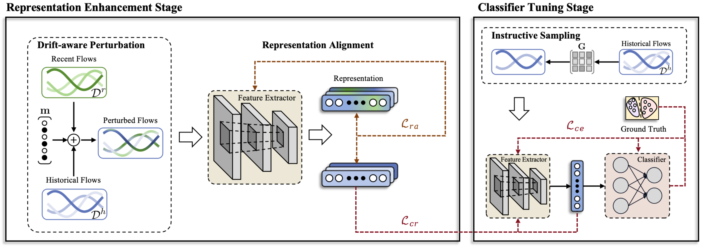

# ReCDA

Code for paper 
[ReCDA: Concept Drift Adaptation with Representation Enhancement for Network Intrusion Detection](https://dl.acm.org/doi/10.1145/3637528.3672007).

<div align="center">
<br>
Overview of ReCDA.
</div>

## Usage

```
python main.py --task re # Representation enhancement
python main.py --task ct # Constrained tuning
```

## Citation

If you find our paper useful for your research, please consider giving a star :star: and citation :pencil: :)

```BibTeX
@inproceedings{yang2024recda,
author = {Yang, Shuo and Zheng, Xinran and Li, Jinze and Xu, Jinfeng and Wang, Xingjun and Ngai, Edith C. H.},
title = {ReCDA: Concept Drift Adaptation with Representation Enhancement for Network Intrusion Detection},
year = {2024},
booktitle = {Proceedings of the 30th ACM SIGKDD Conference on Knowledge Discovery and Data Mining},
pages = {3818–3828},
numpages = {11},
}

@article{yang2025self,
  author={Yang, Shuo and Zheng, Xinran and Li, Jinze and Xu, Jinfeng and Zhang, Xinchen and Ngai, Edith C. H.},
  journal={IEEE Transactions on Dependable and Secure Computing}, 
  title={Self-Supervised Adaptation Method to Concept Drift for Network Intrusion Detection}, 
  year={2025},
}
```
